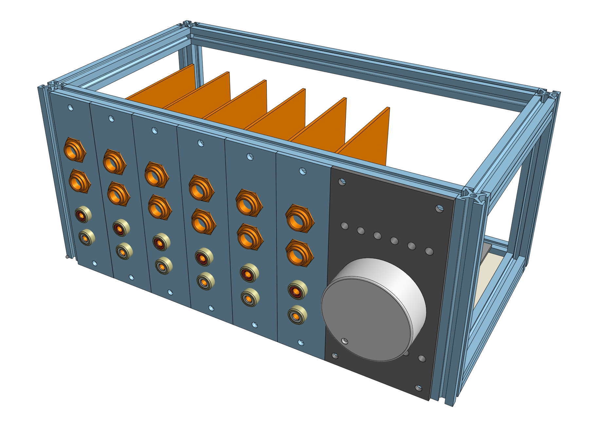

# Silver Box Modular HiFi Preamp

! Note: This project is still very early in development. Features, functions, and interfaces are subject to change

The Silver Box Modular HiFi Preamp allows a person to choose the exact inputs and outputs that a user wants to have. It is common to need to combine or switch between many different sources which all need to go to a single playback source. For instance a person may have TOSLINK optical from their TV, RCA source from a turntable, and a balanced source from a USB audio interface. With this device, all of those can be accommodated and output to one set of speakers.

The chassis provides the analog signal routing, volume control, switching and indication. It is driven by an ESP32 so that functions can be controlled over WiFi, and eventually with smart home integration.

Peripherals are modular cards that can be slotted in to any of the available channels. Peripherals can be active or passive and can function as inputs, outputs, effects, visualizations, maybe more!

The chassis provides each peripheral with:

- Audio send to summing bus, main bus audio output, and audio out from left-adjacent module.
- Global mute and per peripheral muting.
- +/- 12V, +5V, +3.3V power rails
- An I2C data interface with interrupt capabilities
- Automatic identification of common module types with additional configuration possible over I2C

The project is currently in the conceptual/schematic development phase, but I expect to begin prototyping early in 2023.

# Concept sketches/renders:

# Current Status

KiCad design files will be updated here as progress is made.

The current schematics are available in .pdf in the __ecad__ folder:

- [ecad/motherboard.pdf](ecad/motherboard.pdf)
- [ecad/controlboard.pdf](ecad/controlboard.pdf)
- [ecad/peripheral-example-board.pdf](ecad/peripheral-example-board.pdf)

The current 3D models/assemblies for the project are available in .step format in the __mcad__ folder:

- [mcad/silver-box-modular_assembly.step](mcad/silver-box-modular_assembly.step)
- [mcad/motherboard.step](mcad/motherboard.step)
- [mcad/controlboard.step](mcad/controlboard.step)
- [mcad/peripheral-example-board.step](mcad/peripheral-example-board.step)

The BOM for this project is evolving and changing with the project. The current BOM can be viewed at https://octopart.com/bom-tool/pwZCTT5L but it is currently quite messy as parts are picked and substituted based on availability and changing requirements. Expect this to be cleaned up as I get closer to a prototype.

Next steps:

- Final review and production of prototype PCB's.
- Document the mcad model and explain key features.
- Organize and refine the 3d prints that will be required for the prototype.
- Put together power supply module that will be used for early development.
- Create blank/passive modules for prototyping.
- Synchronize/clean the Octopart BOM with the schematic.

Farther out:

- Prototype hardware and develop firmware
- Proper power supply.
- Individual peripheral designs
